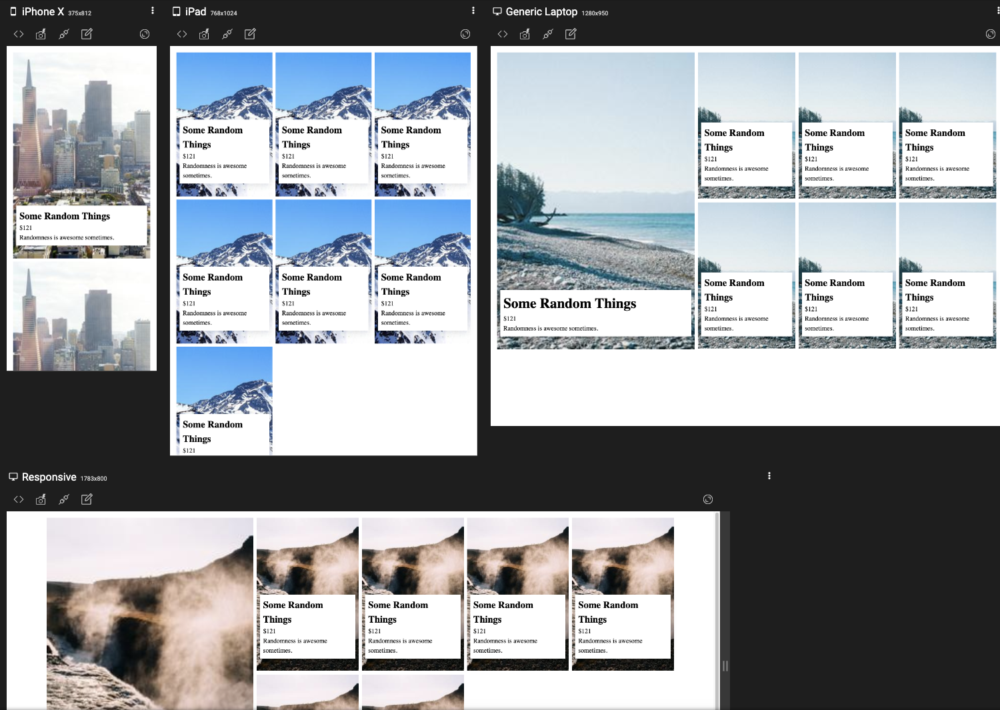

# Learn-CSS-Grid-with-Kevin

A hands on practice to create a simple grid with css by following tutorial from Kevin Powell. Using [picsum](https://picsum.photos/) as an image generator.

### Links:  

- [Learn how to create a responsive CSS grid layout](https://youtu.be/sKFW3wek21Q)
- [Lorem Picsum](https://picsum.photos/)

### Screenshot

